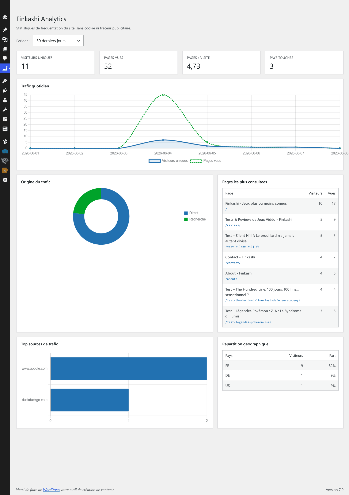

# Finkashi Analytics

Outil de mesure d'audience web auto-hébergé, sans cookie, conforme RGPD par
conception. Développé dans le cadre du titre professionnel **Développeur web
et web mobile (RNCP niveau 5)**, et utilisé en production sur
[finkashi.fr](https://finkashi.fr).



---

## Présentation

Finkashi Analytics est une solution de mesure d'audience pensée comme une
alternative légère à Google Analytics, Matomo ou Plausible, taillée pour les
petits sites éditoriaux qui veulent maîtriser leurs données sans dépendre
d'un service tiers.

L'outil se compose de deux briques :

- une **API REST** en PHP 8.3 (architecture en couches, sans framework),
  responsable de la collecte, de l'agrégation et de la restitution des
  statistiques ;
- un **plugin WordPress** qui injecte le tracker côté visiteur et offre une
  interface d'administration intégrée à WordPress (dashboard, alertes,
  réglages).

Le projet est déployé sur un hébergement mutualisé OVH (sans SSH, base MySQL
unique partagée avec WordPress), ce qui a guidé plusieurs choix d'architecture
détaillés plus bas.

## Fonctionnalités

- **Collecte cookieless** : aucune donnée individuelle stockée, aucun bandeau
  consentement nécessaire.
- **Dashboard intégré** à l'administration WordPress : trafic quotidien,
  pages populaires, sources, répartition géographique, KPIs synthétiques.
- **Alertes paramétrables** sur seuils journaliers (chute de trafic, pic de
  pages vues, etc.) avec historique des déclenchements.
- **Stratégie chaud / froid** : événements bruts conservés 60 jours puis
  archivés et purgés ; agrégats journaliers conservés indéfiniment.
- **Géolocalisation** par IP via la base MaxMind GeoLite2, intégralement
  côté serveur (jamais transmise au navigateur).
- **Cron quotidien** d'agrégation, d'évaluation des alertes et d'archivage,
  exposé en HTTP pour fonctionner sur mutualisé sans SSH.

## RGPD par conception

Le mécanisme d'identification des visiteurs est l'un des points centraux du
projet :

```
hash_visiteur = SHA-256( IP + User-Agent + Domaine + sel_du_jour )
```

Le **sel quotidien** est un secret généré aléatoirement, qui change toutes
les nuits à minuit. Conséquence : un même visiteur garde la même empreinte
pendant une journée (ce qui permet de le compter comme unique), mais **ne
peut plus être reconnu d'un jour à l'autre**. La ré-identification
inter-journées est techniquement impossible.

Aucun cookie n'est déposé, aucune adresse IP n'est conservée en clair, et la
solution rentre dans le cadre de la
[délibération 2020-091 de la CNIL](https://www.cnil.fr/fr/cookies-et-autres-traceurs-la-cnil-publie-des-lignes-directrices-modificatives-et-sa-recommandation)
sur les outils de mesure d'audience exemptés de consentement.

## Stack technique

| Couche                 | Technologies                                            |
| ---------------------- | ------------------------------------------------------- |
| Back-end API           | PHP 8.3, PDO, Composer, PSR-4 (sans framework)          |
| Base de données        | MySQL 8 (InnoDB, utf8mb4)                               |
| Plugin                 | WordPress 6.7, PHP 8.3, JavaScript natif, Chart.js      |
| Géolocalisation        | MaxMind GeoLite2-Country (lecture locale)               |
| Tests                  | PHPUnit 11 (47 tests, 71 assertions)                    |
| Dev local              | Docker (PHP-Apache, MySQL, phpMyAdmin, WordPress)       |
| Production             | OVH mutualisé Starter (sans SSH, base unique partagée)  |

## Architecture

L'API suit une séparation en quatre couches, inspirée du *Clean Architecture* :

```
Domain          ──  Entités et règles métier indépendantes de toute techno
   ↑
Application     ──  Cas d'usage et services applicatifs (collecte, agrégation,
   ↑               détection d'alertes, archivage)
Infrastructure  ──  Accès aux données (repositories PDO, géolocalisation)
   ↑
Http            ──  Contrôleurs, routeur, authentification, sérialisation JSON
```

Ce découpage permet, par exemple, de tester unitairement les services
applicatifs sans toucher à la base, ou de changer le moyen de persistance
sans rien modifier au domaine. C'est aussi ce qui a rendu possible le
déploiement en cohabitation avec WordPress (préfixage des tables paramétrable
sans toucher au code métier).

## Démarrage local

### Prérequis

- Docker Desktop
- Git

### Installation

```bash
git clone https://github.com/alexandre-imbernon/finkashi-analytics.git
cd finkashi-analytics

# Construire et lancer les conteneurs
docker compose up -d --build

# Installer les dépendances PHP (Composer s'exécute dans le conteneur)
docker compose exec php composer install
```

### Services disponibles

| Service       | URL                     | Rôle                         |
| ------------- | ----------------------- | ---------------------------- |
| API           | http://localhost:8080   | Point d'entrée PHP           |
| phpMyAdmin    | http://localhost:8081   | Administration de la base    |
| WordPress     | http://localhost:8090   | Site de test                 |
| MySQL         | localhost:3306          | Base de données              |

### Vérification

```bash
# Lancer la suite de tests
docker compose exec php vendor/bin/phpunit
# OK (47 tests, 71 assertions)

# Tester l'API (avec une clé d'API définie dans .env)
curl http://localhost:8080/stats/trafic
# {"erreur":"Authentification requise."}
```

## Déploiement en production

Le projet est conçu pour fonctionner sur un hébergement mutualisé contraint
(OVH Starter), c'est-à-dire :

- **Pas de SSH** : déploiement par FTP, dépendances Composer pré-installées
  et envoyées dans le `vendor/`.
- **Une seule base MySQL** : cohabitation avec WordPress grâce à un système
  de préfixe de tables (`finkashi_*`) injecté dans tous les repositories
  via la fabrique.
- **Pas de variables d'environnement** : les secrets sont lus depuis un
  fichier `config/secrets.php` non versionné, qui prend le relai du `.env`
  utilisé en développement.
- **Cron en mode HTTP** : un endpoint dédié `/cron/quotidien` permet de
  déclencher la maintenance quotidienne, soit par un cron OVH soit à la
  main, sans dépendre du `php-cli`.

La documentation détaillée du déploiement est dans le dossier professionnel
du titre, disponible sur demande.

## Sécurité

- **Authentification de l'API** par clé partagée sur en-tête `X-Api-Key`
  (et `Authorization: Bearer` en fallback, certains hébergeurs filtrant
  ce dernier).
- **Comparaison constante** des clés via `hash_equals()` pour résister
  aux attaques par mesure de temps.
- **Proxy AJAX** côté plugin WordPress : la clé d'API ne traverse jamais
  le navigateur. Les appels du dashboard passent par un proxy
  authentifié avec capability et nonce.
- **Whitelist d'endpoints et de méthodes HTTP** côté proxy : impossible
  d'utiliser celui-ci comme passerelle générique vers l'API.
- **Requêtes préparées partout** (PDO), pas de concaténation SQL.
- **Hash SHA-256** avec sel quotidien rotatif pour anonymiser les
  visiteurs.

## Tests

La suite couvre les couches métier (domaine, application) et HTTP :

```bash
docker compose exec php vendor/bin/phpunit
```

Les tests utilisent une base SQLite en mémoire pour rester rapides et
totalement isolés du conteneur MySQL.

## Structure du projet

```
finkashi-analytics/
├── config/                 Configuration et secrets (.env / secrets.php)
├── data/                   Base GeoLite2 (non versionnée)
├── database/migrations/    Schémas SQL (dev et prod)
├── docker/                 Configuration des conteneurs
├── public/                 Racine web (front controller + .htaccess)
├── scripts/                Scripts utilitaires (cron CLI)
├── src/
│   ├── Domain/             Entités et règles métier
│   ├── Application/        Services applicatifs (cas d'usage)
│   ├── Infrastructure/     Repositories PDO, géolocalisation, fabrique
│   └── Http/               Contrôleurs, routeur, authentification
├── storage/archives/       Archives JSON.gz d'événements purgés
├── tests/                  Tests PHPUnit (Domain, Application, Http)
└── wordpress-plugin/
    └── finkashi-analytics/ Plugin WordPress (dashboard, alertes, tracker)
```

## Compétences couvertes (RNCP DWWM)

| CP   | Sujet                                                  |
| ---- | ------------------------------------------------------ |
| CP1  | Maquettage, environnement de versionnement et de build |
| CP2  | Interfaces statiques, maquettes, enchaînement          |
| CP3  | Interfaces dynamiques côté client                      |
| CP4  | Composants serveur, API, communication                 |
| CP5  | Conception de base de données                          |
| CP6  | Composants d'accès aux données                         |
| CP7  | Composants métier en architecture en couches           |
| CP8  | Déploiement en production                              |

## Auteur

**Alexandre Imbernon**

[LinkedIn](https://www.linkedin.com/in/alexandre-imbernon/) 
